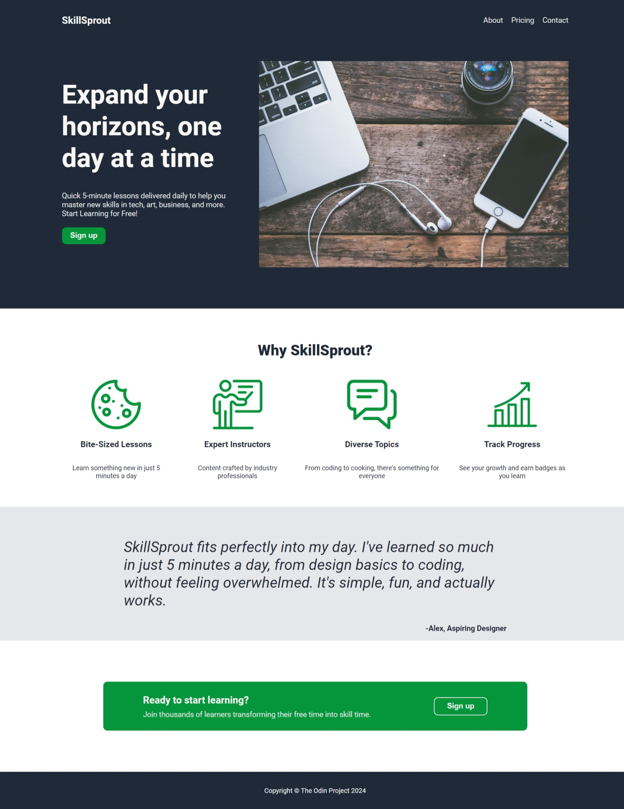

# Landing Page Project | The Odin Project

This is a simple **Landing Page** project built as part of [The Odin Project](https://www.theodinproject.com/lessons/foundations-landing-page) curriculum. The project focuses on applying foundational HTML and CSS concepts to create a visually appealing and responsive webpage.

## Features

- Fully responsive layout.
- Styled using **CSS Flexbox** for a modern and clean structure.
- Consistent design and color scheme to enhance user experience.
- Organized codebase with semantic HTML.

## Live Preview

Check out the live version of the project here: [Live Preview](https://gonalgar.github.io/landing-page/landing_page/index.html)  

## Project Preview

 

## Technologies Used

- **HTML5**: Markup structure and semantics.
- **CSS3**: Styling and layout with a focus on Flexbox.

## Getting Started

To view or modify the project locally:

1. Clone this repository:
   ```bash
   git clone https://github.com/gonalgar/landing-page.git
2. Navigate to the project directory:
   ```bash
   cd landing-page
3. Open the index.html file in your browser to view the page.

## What I Learned
Through this project, I practiced:

- Structuring a webpage using semantic HTML.
- Applying Flexbox for flexible and responsive layouts.
- Designing a visually appealing landing page with CSS.

## Acknowledgements
This project is part of [The Odin Project Foundations](https://www.theodinproject.com/paths/foundations/courses/foundations) curriculum. It provides a hands-on introduction to building websites using fundamental web technologies.

## Image Credits
The images used in this project are sourced from external creators. Full credit is given to the original creators for their work:

- Main Image by Jessica Lewis (Pexels).
- Chat Icon by Pixel perfect (Flaticon).
- Cookie Icon by Freepik (Flaticon).
- Progress Icon by lalawidi (Flaticon).
- Teacher Icon by Bert Flint (Flaticon).

If you use this project and replace the images, ensure you credit the respective image creators as required.


## License
This project is open-source and available under the **MIT License**.
